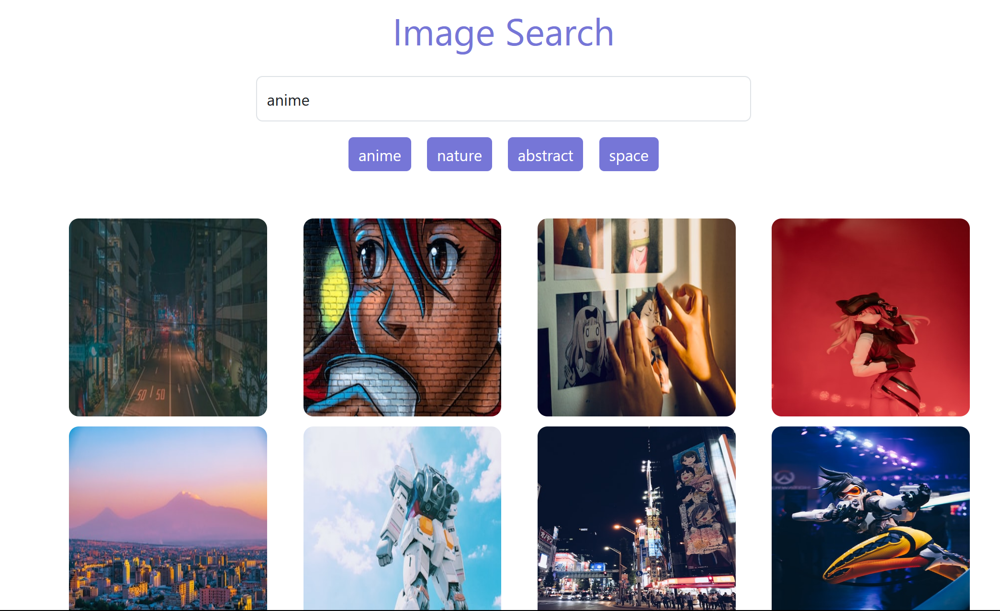

# Unsplash-image-clone

## App UI


## Tools Used
- React
- JavaScript
- Bootstrap
- Axios

## Fetch API using axios

```js
import axios from "axios";

const API_URL = "https://api.unsplash.com/search/photos";
const IMG_PER_PAGE = 20;

const fetchImages = async () => {
    try {
      if (searchInput.current.value) {
        const { data } = await axios.get(
          `${API_URL}?query=${
            searchInput.current.value
          }&page=${page}&per_page=${IMG_PER_PAGE}&client_id=${
            import.meta.env.VITE_API_KEY
          }`
        );
        console.log(data);
      }
    } catch (error) {
      console.log(error);
    }
  }

```